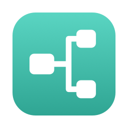
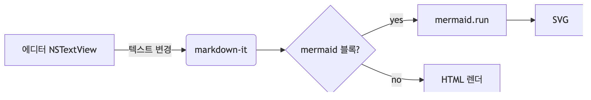
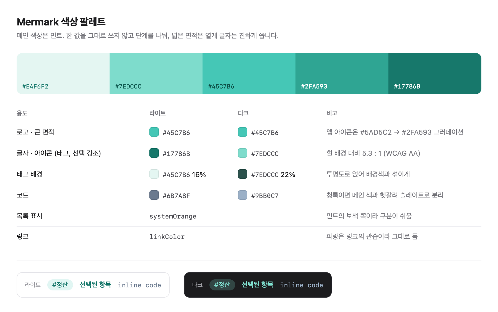

# Mermark



Mermaid 다이어그램을 **바로 이미지로 뽑아 쓰는** macOS 마크다운 뷰어/에디터.

프리뷰의 Mermaid 블록에 마우스를 올리면 `PNG 복사 · PNG 저장 · SVG 저장` 버튼이 뜹니다.
캔버스 변환이나 외부 서비스 없이, 화면에 보이는 것과 동일한 품질로 내보냅니다.



*위 이미지는 실제로 Mermark에서 PNG로 내보낸 결과입니다 (2x, 투명 배경).*

## 무엇을 하는 앱인가

- **Mermaid 이미지 내보내기** — 고해상도 PNG를 파일로 저장하거나 클립보드로 복사, SVG로 저장.
  해상도(1x/2x/3x)·테마·배경은 설정(`⌘,`)에서 고릅니다
- **일괄 내보내기** — `⌘⇧E`로 문서 안의 모든 다이어그램을 `문서명-1.png`부터 순서대로 한 폴더에 저장
- **작업 공간** — 폴더를 작업 공간으로 연결하면 **하위 폴더까지** 훑어 `.md`를 모읍니다.
  여러 개를 동시에 연결할 수 있고, 사이드바에서 접었다 펼 수 있습니다
- **평범한 `.md` 파일** — 독자 포맷도 락인도 없어 다른 마크다운 앱과 같은 파일을 그대로 함께 씁니다
- **메모장처럼 빠른 작성** — `⌘N`으로 제목 입력 없이 바로 타이핑, 저장 버튼 없는 자동 저장,
  첫 줄이 곧 파일명
- **탭** — 노트를 열면 상단에 탭으로 쌓입니다. 이미 열려 있으면 그 탭으로 갑니다.
  파일명이 바뀌어도 탭 자리는 그대로고, 밖에서 지우면 탭도 닫힙니다
- **뷰어 / 에디터 / 분할** — `⌘1` `⌘2` `⌘3`으로 즉시 전환. 분할 모드에서는 양쪽 스크롤이 줄 단위로 연동
- **문법 강조** — 에디터에서 제목·강조·코드·링크·목록을 색과 굵기로 구분
- **제목·본문 검색** — 사이드바 검색창으로 연결된 작업 공간 전체를 훑습니다. 제목이 걸린 노트가 먼저 나옵니다
- **태그** — 검색창에 `#정산`을 치면 그 태그로 걸러집니다. `#정산 회의`처럼 글자와 섞어 쓸 수 있고,
  프리뷰의 태그를 눌러도 검색창에 채워집니다
- **목차** — `⌘⌥T`나 툴바 버튼으로 오른쪽 패널을 열고 닫습니다. 항목을 누르면 그 위치로 이동
- **할 일 목록** — `- [ ]` / `- [x]`를 체크박스로 표시하고, 누르면 원본 파일이 바로 바뀝니다
- **노트 지우기** — 사이드바나 탭에서 우클릭 → 확인 창을 거쳐 휴지통으로 보냅니다.
  바로 지우지 않으므로 Finder에서 되돌릴 수 있습니다
- **로컬 이미지** — ``처럼 노트 기준 상대경로나 `/`로 시작하는 작업 공간 최상위 기준 경로 모두 표시.
  ``처럼 파일명에 공백이 있어도 그대로 씁니다
- **노트 간 링크** — `[다른 노트](./other.md)`를 누르면 앱 안에서 이동하고, `#섹션` 앵커까지 따라갑니다.
  외부 주소는 기본 브라우저로 넘깁니다
- **외부 변경 자동 반영** — 작업 공간을 Finder나 다른 에디터로 고치면 앱이 알아서 갱신.
  한 공간이 사라져도 나머지는 그대로 쓰고, 사라진 것은 위에 한 줄로만 알립니다
- **수식** — `$E = mc^2$` 인라인과 `$$...$$` 블록을 KaTeX로 조판. 폰트까지 번들해 오프라인에서 동작
- **프론트매터** — 문서 앞의 `---` 블록을 표 형태로 정리해 보여줍니다
- **PDF 내보내기** — `⌘⇧P`로 렌더된 문서 전체를 쪽 단위로 나눈 A4 PDF로 저장
- **빠른 메모** — 메뉴바 아이콘이나 어디서든 `⌘⇧N`으로 창을 띄워 바로 적고 `⌘⏎`로 저장.
  파일명은 `2026-07-31 1432.md`처럼 시각이 됩니다
- **명령줄 도구** — `mermark new 회의록`으로 만들고 `mermark open 회의록`으로 앱에서 엽니다.
  터미널에서 만들고 앱에서 보는 식으로 섞어 쓸 수 있습니다
- **완전 오프라인** — 마크다운·다이어그램·수식·코드 강조 라이브러리를 모두 앱에 번들

## 요구 사항

- macOS 14 이상
- 빌드에는 Xcode 16 이상

배포용 서명은 하지 않습니다. 개인용 비배포 앱을 전제로 App Sandbox를 사용하지 않으며,
그래서 작업 공간 폴더 접근에 security-scoped bookmark가 필요 없습니다.

## 빌드와 실행

```bash
git clone https://github.com/HongYeseul/mac-app-mermark.git
cd mac-app-mermark
xcodebuild -project Mermark.xcodeproj -target Mermark -configuration Debug SYMROOT=build build
open build/Debug/Mermark.app
```

Xcode에서 `Mermark.xcodeproj`를 열고 Run 해도 됩니다.

처음 실행하면 폴더를 작업 공간으로 연결하라는 화면이 나옵니다. 작업 공간 안의 `.md` 파일이
**하위 폴더까지 포함해** 사이드바에 수정일 순으로 나열됩니다. 하위 폴더에 있는 노트는 이름 아래에
그 경로가 함께 보입니다.

작업 공간은 여러 개를 연결할 수 있습니다. 사이드바에서 공간 이름을 누르면 접히고, 이름 옆 `+`는
그 공간에 새 노트를 만듭니다. 우클릭하면 Finder에서 열거나 연결을 해제할 수 있습니다
(파일은 지우지 않습니다).

창 제목에는 지금 보고 있는 노트가 어느 작업 공간 것인지와 그 경로가 뜹니다.

작업 공간을 iCloud Drive 안에 두면 동기화는 따로 할 일이 없습니다.

## 사용법

| 조작 | 동작 |
|---|---|
| `⌘N` | 새 노트 — 제목 없이 바로 본문부터 입력 |
| `⌘O` | 작업 공간 연결 |
| `⌘1` / `⌘2` / `⌘3` | 뷰어 / 에디터 / 분할 모드 |
| `⌘⌥T` | 목차 패널 열기/닫기 |
| `⌘⇧E` | 문서 안 모든 다이어그램을 한 폴더에 내보내기 |
| `⌘⇧P` | 문서 전체를 PDF로 내보내기 |
| `⌘⇧N` | 어디서든 빠른 메모 창 (전역 단축키) |
| 메뉴바 ✏️ 아이콘 | 빠른 메모 팝오버 |
| `⌘,` | 설정 (메인 색상 · 명령줄 도구 · 내보내기 해상도 · 테마 · 배경) |
| 사이드바 검색창 | 제목과 본문을 함께 검색 |
| 사이드바 검색창 | `#태그`로 태그 필터, 글자와 섞어 쓸 수 있음 |
| 작업 공간 이름 옆 `+` | 그 공간에 새 노트 |
| 탭 `×` / 탭 우클릭 | 탭 닫기 · 이 탭만 남기기 · Finder에서 보기 · 휴지통으로 이동 |
| 탭 줄 끝의 `+` | 새 노트 |
| 사이드바 위 "작업 공간 추가" | 최근 폴더 연결 · 폴더 고르기 |
| 사이드바 노트 우클릭 | Finder에서 보기 · 경로 복사 · 휴지통으로 이동 |
| 사이드바 작업 공간 우클릭 | Finder에서 보기 · 경로 복사 · 연결 해제 (확인 후, 파일은 그대로) |
| Mermaid 블록에 마우스 올리기 | 복사 · 저장 툴바 (저장은 PNG/SVG 중 고름) |

**첫 줄이 파일명이 됩니다.** `# 회의록`이라고 쓰면 파일이 `회의록.md`가 됩니다.
`/`와 `:`는 `-`로 바뀌고, 이름이 겹치면 `회의록 2.md`처럼 번호가 붙습니다.

단, **파일명과 첫 줄이 원래 다른 노트는 이름을 바꾸지 않습니다.** 다른 앱에서 만든 노트를
Mermark로 열어 편집해도 파일명이 그대로 유지되므로, 다른 노트에서 걸어둔 링크가 깨지지 않습니다.

## 명령줄에서 쓰기

설정(`⌘,`)에서 **명령줄 도구 설치**를 누르면 `/usr/local/bin/mermark`에 링크가 걸립니다.
권한이 없으면 직접 실행할 `ln -s` 명령을 알려 줍니다.

```bash
mermark new 회의록          # 만들고 경로를 출력 → vim "$(mermark new 회의록)"
mermark open 회의록         # 앱에서 그 노트를 연다 (앱이 꺼져 있으면 띄운다)
mermark list --tag 정산     # 노트 경로 목록 (최근 수정 순)
mermark path               # 작업 공간 경로
```

`--workspace <이름>`으로 어느 작업 공간을 볼지 고릅니다. 출력이 경로 한 줄씩이라
`mermark list | fzf | xargs vim`처럼 이어 붙이기 좋습니다.

앱과 도구는 같은 설정 파일을 봅니다.

```
~/.config/mermark/config.json
```

## 동작 방식

에디터는 네이티브 `NSTextView`, 프리뷰는 `WKWebView`인 하이브리드 구조입니다.
Mermaid가 자바스크립트 라이브러리라 프리뷰는 웹뷰가 자연스럽고, 에디터는 한글 입력(IME)과
시스템 단축키를 그대로 쓰기 위해 네이티브로 둡니다.

```
┌──────────┐ ┌──────────────┐ ┌──────────────────┐
│ Sidebar  │ │ Editor       │ │ Preview          │
│ 노트 목록 │ │ NSTextView   │ │ WKWebView        │
│          │ │              │ │ markdown-it      │
│          │ │              │ │ + mermaid        │
│          │ │              │ │ + highlight.js   │
└──────────┘ └──────────────┘ └──────────────────┘
      ▲             │                   ▲
      │             ▼                   │
   FSEvents    .md 파일 (작업 공간)      │
   (외부 변경)                          │
                오프스크린 WKWebView ────┘
                + takeSnapshot → PNG
```

**PNG 내보내기**는 화면에 보이지 않는 전용 웹뷰에 해당 다이어그램만 렌더한 뒤
`WKWebView.takeSnapshot(with:)`으로 찍습니다. 캔버스로 SVG를 변환하는 흔한 방법이 겪는
`foreignObject`·폰트·CORS 문제가 없고, 프리뷰와 100% 같은 렌더링 품질이 나옵니다.

**SVG 내보내기**는 `htmlLabels: false`로 다시 렌더해 라벨을 `<foreignObject>`(HTML) 대신
순수 SVG `<text>`로 뽑습니다. 다른 앱에서 열어도 글자가 깨지지 않습니다.

표준 마크다운은 링크 주소에 공백을 허용하지 않아 ``이 이미지로 파싱되지
않습니다. 한글 파일명은 공백이 흔하므로, 렌더 직전에 주소의 공백만 `%20`으로 바꿉니다.
코드 블록·인라인 코드 안과 이미 인코딩된 주소는 건드리지 않고, 줄 안에서만 바꾸므로
스크롤 동기화의 줄 매핑도 그대로입니다.

**로컬 이미지**는 `mermark-local://` 전용 URL 스킴으로 서빙합니다. 프리뷰 HTML이 앱 번들에서
로드되기 때문에 노트 기준 상대경로가 그대로는 열리지 않아서, 렌더 후 이미지 주소를 이 스킴으로
바꾸고 Swift가 노트 위치(또는 작업 공간 최상위) 기준으로 파일을 찾아 돌려줍니다. 작업 공간 밖을 가리키는
경로는 심볼릭 링크까지 확인해 거부합니다.

**노트 간 링크**도 같은 스킴을 씁니다. 렌더 후 상대경로 링크 주소를 바꿔두고, 클릭이 일어나면
`decidePolicyFor`에서 가로채 이동을 취소한 뒤 앱이 해당 노트를 엽니다. 헤딩에는 GitHub과 같은
규칙의 `id`를 붙여 `#섹션` 앵커가 동작합니다.

**PDF 내보내기**는 쪽을 나눠 주는 `WKWebView.printOperation`이 `run()`에서 반환되지 않아
쓰지 못했습니다. 대신 본문 블록들의 위쪽 좌표를 받아 한 쪽 높이를 넘지 않는 마지막 블록
경계에서 끊고, 조각마다 `createPDF`를 부른 뒤 고정 크기 A4 쪽 위쪽에 얹습니다.
글줄이 중간에서 잘리지 않고 쪽 크기도 균일합니다.

**탭 줄**은 `safeAreaInset`이 아니라 `VStack`으로 얹습니다. `safeAreaInset`은 자식의 프레임을
줄이지 않고 안전 영역만 알려주는데, `NSViewRepresentable`로 감싼 `NSScrollView`와 `WKWebView`는
그걸 무시하고 프레임 전체를 써서 본문 첫 줄이 탭 줄 밑으로 들어갑니다. 창에 툴바가 있을 때만
생기는 차이라, 검증도 툴바를 붙인 창에서 잽니다.

**스크롤 동기화**는 markdown-it의 `token.map`으로 최상위 블록마다 `data-line`을 심어두고,
에디터의 최상단 보이는 줄과 프리뷰 앵커를 비례 보간해 맞춥니다. 비율이 아니라 줄 기준이라
Mermaid 블록처럼 "원본 6줄 = 화면 300px"인 구간에서도 어긋나지 않습니다.

자세한 설계와 로드맵은 [docs/PLAN.md](docs/PLAN.md), 색과 아이콘은
[docs/DESIGN.md](docs/DESIGN.md)에 있습니다.

## 검증

별도 테스트 타깃 없이, 앱 소스를 그대로 `swiftc`로 링크해 실제 파일시스템과 실제 AppKit 뷰로
돌립니다. 모킹은 쓰지 않습니다. 스위트마다 파일을 고르지 않고 앱 소스를 통째로 링크하므로,
의존 파일이 늘어도 스크립트를 고칠 일이 없습니다(진입점이 겹치는 `MermarkApp.swift`만 제외).

```bash
./scripts/run-tests.sh
```

| 스위트 | 검증 내용 |
|---|---|
| `note-store` | 실파일·실 FSEvents 기반 작업 공간 동작과 검색·다중 연결 86 케이스 |
| `editor-scroll` | 실제 `NSTextView`로 줄 ↔ 스크롤 왕복 13 케이스 |
| `syntax-highlight` | 문법 토큰 범위와 실제 `NSTextStorage` 속성 적용 31 케이스 |
| `outline` | 코드 펜스·`C#`·프론트매터를 가려내는 목차 추출 18 케이스 |
| `mermaid-blocks` | 펜스 길이·정보 문자열·미닫힘을 다루는 블록 추출 18 케이스 |
| `export-options` | 실제 렌더·스냅샷으로 해상도·배경·테마 반영 17 케이스 |
| `batch-export` | 실제 `MermaidExporter`로 일괄 내보내기 파일 생성 10 케이스 |
| `image-resources` | 상대경로 이미지 해석과 실제 `WKWebView` 로드 17 케이스 |
| `link-routing` | 노트 간 이동·앵커·외부 링크 라우팅과 헤딩 슬러그 23 케이스 |
| `document-export` | 프론트매터 표시와 PDF 생성·텍스트 포함 여부 16 케이스 |
| `quick-capture` | 빠른 메모 저장 규칙과 전역 단축키 등록·해제 16 케이스 |
| `tags` | 태그 추출(헤딩·주소·코드 제외)·필터·프리뷰 표시 38 케이스 |
| `task-list` | 할 일 체크박스 렌더와 원본 줄 뒤집기 18 케이스 |
| `math` | KaTeX 조판·폰트 로드·통화 표기 오탐 방지 16 케이스 |
| `view-mode` | 실제 `NSHostingView`로 모드 전환 시 상태 보존 12 케이스 |
| `cli` | 실제 `mermark` 실행 파일을 자식 프로세스로 돌린 명령줄 도구 76 케이스 |
| `tabs` | 탭 열기·닫기·이름 변경·삭제와 실제 렌더 39 케이스 |
| `layout` | 탭 줄이 본문을 가리지 않는지 실제 창 좌표로 6 케이스 |
| `trash` | 실제로 휴지통에 옮겨지는지와 확인 창·탭·선택 정리 26 케이스 |
| `workspace-menu` | 실제 우클릭 이벤트로 작업 공간 메뉴와 연결 해제 21 케이스 |

프리뷰의 `data-line` 앵커와 양방향 스크롤은 브라우저에서 `Mermark/Resources/preview.html`을
직접 열어 확인합니다 (문서 끝 클램프 구간을 빼면 줄 왕복 오차 0).

## 프로젝트 구조

```
Mermark/
├── MermarkApp.swift          앱 진입점, 메뉴 명령, mermark:// 주소 수신
├── ContentView.swift         3분할 레이아웃, 모드 전환, 목차, 스크롤 동기화 배선
├── NoteTabBar.swift          상단 탭 줄
├── WorkspaceHeader.swift     사이드바 작업 공간 이름 줄
├── SettingsView.swift        메인 색상·내보내기 옵션 (⌘,)
├── Theme.swift               테마별 색 정의 (색을 바꾸는 단 하나의 자리)
├── Brand.swift               고른 테마를 앱·프리뷰·Dock 아이콘에 배포
├── AppIcon.swift             아이콘을 코드로 그림 (Dock과 .icns가 같은 코드)
├── CLIInstaller.swift        번들 안 mermark를 /usr/local/bin에 링크
├── Notes/
│   ├── NoteStore.swift       작업 공간·노트 목록·자동 저장·파일명 동기화·FSEvents
│   ├── SearchQuery.swift     검색어에서 #태그와 글자를 갈라냄
│   ├── MarkdownTags.swift    본문 #태그와 프론트매터 tags 추출
│   └── MarkdownTaskList.swift  할 일 체크박스 뒤집기
├── Editor/
│   ├── EditorController.swift  NSTextView 소유, 스크롤 보고/이동
│   ├── LineMath.swift          문자 인덱스 ↔ 줄 번호 변환
│   ├── MarkdownOutline.swift   목차(헤딩) 추출
│   ├── MarkdownSyntax.swift    문법 강조용 토큰 범위 계산
│   └── MarkdownEditor.swift    SwiftUI 래퍼
├── Preview/
│   ├── PreviewController.swift WKWebView 소유, 렌더 디바운스, 메시지 처리
│   ├── MermaidExporter.swift   오프스크린 스냅샷 기반 PNG/SVG 내보내기, 일괄 저장
│   ├── MermaidBlocks.swift     본문에서 mermaid 펜스 추출
│   ├── LocalResourceHandler.swift  상대경로 이미지용 전용 URL 스킴
│   ├── PreviewLinkRouter.swift 링크 클릭 처리 규칙
│   ├── ExportOptions.swift     해상도·테마·배경 옵션
│   ├── PDFExporter.swift       문서 전체 PDF 저장
│   └── MarkdownPreview.swift   SwiftUI 래퍼
├── QuickCapture/
│   ├── QuickCaptureView.swift  메뉴바·단축키가 함께 쓰는 입력 화면
│   ├── QuickCapturePanel.swift 전역 단축키로 띄우는 떠 있는 창
│   ├── GlobalHotKey.swift      Carbon 기반 전역 단축키 등록
│   └── QuickCaptureCoordinator.swift  단축키와 패널 연결
└── Resources/
    ├── preview.html          프리뷰 템플릿 (data-line, 호버 툴바, 스크롤 API)
    ├── export.html           내보내기 전용 최소 템플릿
    ├── *.min.js, *.min.css   번들 라이브러리
    └── KaTeX_*.woff2         수식 폰트 (평면 배치, scripts/fetch-vendor.sh 참고)

Shared/                       앱과 명령줄 도구가 함께 쓰는 코드
├── WorkspaceConfig.swift     ~/.config/mermark/config.json 읽기/쓰기
├── NoteNaming.swift          파일명 규칙 (첫 줄 = 제목, 중복 회피)
├── NoteScanner.swift         작업 공간을 하위 폴더까지 훑기
├── MarkdownTags.swift        본문 #태그와 프론트매터 tags 추출
├── MermarkURL.swift          mermark:// 주소 만들기/검사
└── MermarkCommand.swift      mermark 명령 동작

MermarkCLI/
└── main.swift                출력과 앱 실행만 맡는 얇은 껍데기
```

명령줄 도구는 앱 번들의 `Contents/Helpers/mermark`에 들어갑니다. `Contents/MacOS`에 두면
대소문자를 구분하지 않는 파일시스템에서 앱 바이너리 `Mermark`와 같은 이름이라 서로를 덮어씁니다.

AppKit 뷰를 SwiftUI 래퍼가 아니라 컨트롤러가 소유하는 것이 핵심입니다. 덕분에 모드를 전환해도
뷰가 재생성되지 않아 실행 취소 기록·스크롤 위치·Mermaid 렌더 결과가 그대로 유지됩니다.

## 번들 라이브러리 갱신

```bash
./scripts/fetch-vendor.sh
```

버전은 스크립트 상단에서 바꿉니다. 각 라이브러리의 라이선스는
[THIRD_PARTY_NOTICES.md](THIRD_PARTY_NOTICES.md)를 참고하세요.

Xcode의 synchronized folder는 리소스를 번들 `Resources` 루트에 **평면으로** 복사합니다.
그래서 KaTeX 폰트도 하위 폴더 없이 두고, 스크립트가 CSS의 `url(fonts/...)`에서 `fonts/`를
지웁니다. 번들하지 않는 woff·ttf 대체 경로도 함께 제거합니다.

## 색상과 아이콘



메인 색상은 민트입니다. 한 가지 값을 그대로 쓰지 않고 단계를 나눠 씁니다 —
파스텔 톤은 로고처럼 넓은 면적에서는 좋지만, 흰 배경 위 글자로 쓰면 대비가 모자랍니다.

설정(`⌘,`)에서 민트·세이지·제이드·코퍼·플럼 중 고를 수 있고, **Dock 아이콘도 함께 바뀝니다**
(Finder 아이콘은 앱 번들 안에 있어 그대로입니다).

고른 이유, 다른 색을 그대로 둔 이유, 아이콘을 다시 만드는 방법은
[docs/DESIGN.md](docs/DESIGN.md)에 정리했습니다. 색 정의는
[Mermark/Theme.swift](Mermark/Theme.swift)에 모여 있습니다.

## 백로그

초안의 로드맵은 모두 반영했습니다. 이후에 발견한 것들은
[GitHub Issues](https://github.com/HongYeseul/mac-app-mermark/issues)로 관리합니다.

라벨은 세 가지만 씁니다.

| 라벨 | 뜻 |
|---|---|
| `bug` | 동작하지 않는 것 |
| `enhancement` | 개선·추가 기능 |
| `polish` | 완성도 다듬기 |

쓰다가 불편한 점이 생기면 이슈로 남기고, 고칠 때는 재현·배경·참고 파일이
이슈에 적혀 있으니 거기서부터 보면 됩니다.

## 알려진 제약

- 이미지는 그 노트가 속한 작업 공간 안의 파일만 표시됩니다. 작업 공간 밖을 가리키는 경로(`../../외부.png`)는 거부합니다
- 세로로 아주 긴 다이어그램은 픽셀 상한(8192px)에 맞춰 해상도가 자동으로 낮아집니다.
  설정한 배율보다 작게 나올 수 있습니다
- 목차는 `#` 방식(ATX) 헤딩만 인식합니다. 밑줄(setext) 방식은 아직 지원하지 않습니다
- 앱 서명을 하지 않으므로 다른 Mac으로 옮기면 Gatekeeper 경고가 납니다
- 프론트매터는 `키: 값`과 `- 항목` 목록만 표시합니다. 중첩 구조는 다루지 않습니다
- 전역 단축키 `⌘⇧N`은 다른 앱이 이미 쓰고 있으면 등록에 실패합니다. 이때는 메뉴바 아이콘으로
  빠른 메모를 쓸 수 있고, 실패 사실은 콘솔 로그에 남습니다

## 라이선스

[MIT](LICENSE)
